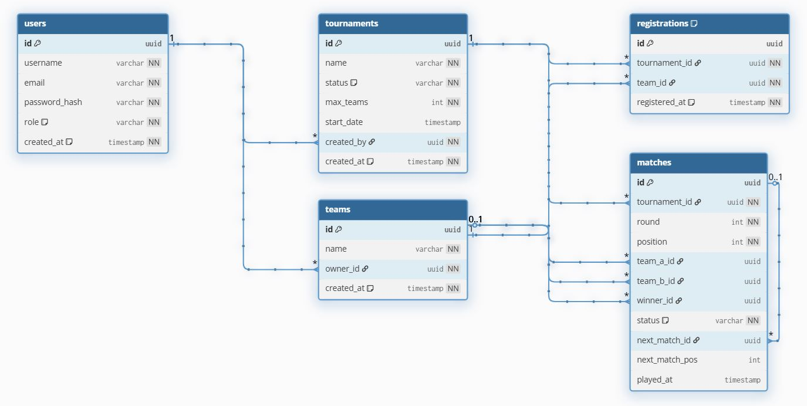

# Tournament Manager API

A RESTful API for managing single-elimination tournaments. Users can create teams, register for open tournaments, and track match results through a live bracket. Built as a portfolio project demonstrating clean Java backend architecture with production-ready practices.

**Live demo:** _coming soon — deploying to Render_

---

## Table of Contents

- [Features](#features)
- [Tech Stack](#tech-stack)
- [Architecture](#architecture)
- [Entity-Relationship Diagram](#entity-relationship-diagram)
- [API Endpoints](#api-endpoints)
- [Running Locally](#running-locally)
- [Environment Variables](#environment-variables)
- [Screenshots](#screenshots)

---

## Features

- JWT-based authentication with role separation (`ADMIN` / `USER`)
- Full tournament lifecycle: open → registrations closed → bracket generated → in progress → finished
- Automatic single-elimination bracket generation with BYE handling for non-power-of-2 team counts
- Round advancement triggered automatically when a match result is recorded
- Input validation and consistent error responses across all endpoints
- Interactive API documentation via Swagger UI

---

## Tech Stack

| Layer | Technology |
|---|---|
| Language | Java 21 |
| Framework | Spring Boot 4.0 |
| Security | Spring Security + JWT (jjwt 0.12) |
| Persistence | Spring Data JPA + Hibernate |
| Database | PostgreSQL 16 |
| Migrations | Flyway |
| Validation | Jakarta Bean Validation |
| Build | Maven |
| Containerisation | Docker + Docker Compose |
| API Docs | SpringDoc OpenAPI (Swagger UI) |
| Testing | JUnit 5, Mockito, Testcontainers |

---

## Architecture

The project follows a classic **layered architecture**, keeping responsibilities clearly separated and making every layer independently testable.

```
Controller  →  Service  →  Repository  →  Database
               (business logic)
```

```
com.cfval.tournament_manager
├── controller        HTTP layer — request mapping, @PreAuthorize
├── service           Business logic, transaction boundaries
├── repository        Spring Data JPA interfaces
├── model             JPA entities and enums
├── dto
│   ├── request       Validated inbound payloads (records)
│   └── response      Outbound API contracts (records)
├── exception         Custom exceptions + @ControllerAdvice handler
├── security          JWT filter, UserDetailsService, SecurityConfig
└── config            OpenAPI bean, DataSeeder
```

**Key design decisions:**

- **UUIDs** as primary keys — collision-resistant, safe to expose in URLs
- **DTOs are records** — immutable, concise, zero boilerplate
- **Entities are never serialised directly** — every endpoint returns a DTO
- **Bracket logic** uses `next_match_id` + `next_match_pos` columns so each match knows where its winner advances, enabling automatic round progression without a separate scheduler
- **Flyway** manages schema evolution; JPA runs in `ddl-auto: validate` mode so any schema drift is caught at startup

---

## Database Schema



| Table | Description |
|---|---|
| `users` | Registered accounts with role (`ADMIN` or `USER`) |
| `tournaments` | Tournament records with status and capacity |
| `teams` | Teams owned by a user; unique name per owner |
| `registrations` | Join table between tournaments and teams (unique per pair) |
| `matches` | Bracket nodes; self-referencing via `next_match_id` for round advancement |

---

## API Endpoints

All endpoints return `application/json`. Secured endpoints require `Authorization: Bearer <token>`.

### Authentication

| Method | Path | Access | Description |
|---|---|---|---|
| `POST` | `/api/auth/register` | Public | Create a new user account |
| `POST` | `/api/auth/login` | Public | Authenticate and receive a JWT |

### Tournaments

| Method | Path | Access | Description |
|---|---|---|---|
| `GET` | `/api/tournaments` | Public | List all tournaments |
| `GET` | `/api/tournaments/{id}` | Public | Tournament detail |
| `POST` | `/api/tournaments` | Admin | Create a tournament |
| `PUT` | `/api/tournaments/{id}/close-registrations` | Admin | Close registrations |
| `POST` | `/api/tournaments/{id}/bracket` | Admin | Generate the bracket |
| `GET` | `/api/tournaments/{id}/bracket` | Public | View the bracket |

### Teams & Registrations

| Method | Path | Access | Description |
|---|---|---|---|
| `POST` | `/api/teams` | User | Create a team |
| `GET` | `/api/teams` | User | List own teams |
| `POST` | `/api/tournaments/{id}/registrations` | User | Register a team in a tournament |

### Matches

| Method | Path | Access | Description |
|---|---|---|---|
| `POST` | `/api/matches/{id}/result` | Admin | Record a result; advances the bracket automatically |

### Error format

All errors follow a consistent envelope:

```json
{
  "status": 422,
  "error": "Unprocessable Entity",
  "message": "Tournament is not open for registration",
  "timestamp": "2025-06-01T14:32:00"
}
```

---

## Running Locally

### Prerequisites

- Java 21
- Docker and Docker Compose

### Steps

**1. Clone the repository**

```bash
git clone https://github.com/<your-username>/tournament-manager.git
cd tournament-manager
```

**2. Start PostgreSQL**

```bash
docker-compose up -d
```

This starts PostgreSQL 16 on port `5433` (port `5432` is left free for any local Postgres instance).

**3. Run the application**

```bash
./mvnw spring-boot:run
```

Flyway migrations run automatically on startup. A default admin account is seeded if none exists:

| Field | Value |
|---|---|
| Username | `admin` |
| Password | `Admin1234` |

**4. Open Swagger UI**

```
http://localhost:8080/swagger-ui.html
```

Click **Authorize**, paste the JWT from `POST /api/auth/login`, and explore all endpoints interactively.

---

## Environment Variables

When running via Docker (e.g. on Render), override these variables to connect to your managed database and use a secure JWT secret:

| Variable | Description | Default |
|---|---|---|
| `SPRING_DATASOURCE_URL` | JDBC connection URL | `jdbc:postgresql://localhost:5433/tournament_manager` |
| `SPRING_DATASOURCE_USERNAME` | Database username | `tournament_user` |
| `SPRING_DATASOURCE_PASSWORD` | Database password | `tournament_pass` |
| `APP_SECURITY_JWT_SECRET` | Base64-encoded HMAC-SHA secret (≥ 32 bytes) | _(dev value in application.yaml)_ |
| `APP_SECURITY_JWT_EXPIRATION` | Token lifetime in milliseconds | `86400000` (24 h) |

Spring Boot maps environment variables to properties automatically (`_` → `.`, lowercase), so no extra configuration is needed.

---

## Screenshots

_Swagger UI and sample request/response screenshots will be added after the live deployment._

<!-- Add screenshots here:


-->
